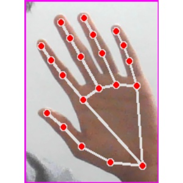
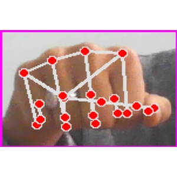
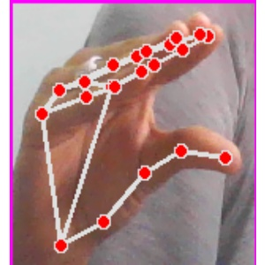
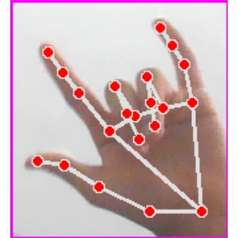
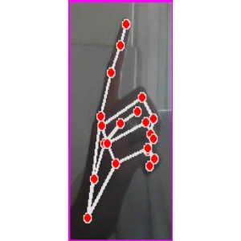
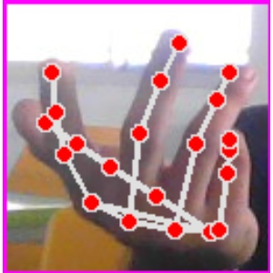

# Real-time Sign language Classification using MobileNet
#### Sign language is the mode of communication among the verbally and audibly impaired community. Although sign language contains many signs with diverse variations, it is still tricky for impaired people to access public resources and communicate with the rest of the world. Applications based on machine and deep learning models are rapidly being developed to classify sign languages efficiently through sensors and visual-based systems. Real-time sign language classification uses a transfer learning technique, where a pre-trained model on large datasets is accessed to train on user-interested classification problems. This efficiently reduces the computational cost and time for developing classification models. A diverse American Standard Sign image dataset is collected using Cv2 zone API. Mobile-net architecture is used for training on the developed dataset. The trained model is deployed with a webcam for real-time sign classification. This project demonstrates the real-life application of deep learning models for inclusive and happy lives.
---
####
Data has been collected in form of images. We have collected images of hands signing the following American Sign Language
1. Hello
2. I love you
3. Where
4. What
5. Yes
6. No
####
A total of 18 volunteers participated in data collection. We have collected images of signs from two different hands.
---
### How to use?
#### 
1. Clone the repository
2. Run test.py
3. Try to stay atleast 2 feet away from the camera while performing the signs

### References
[Code inspired from this github profile](https://github.com/nicknochnack)
